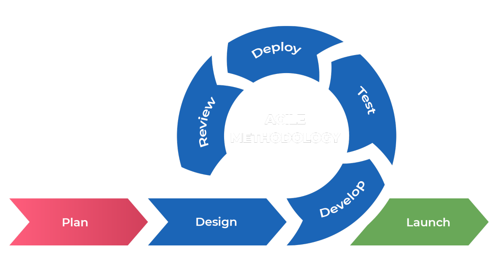

  

<h3 align="center">
  Hajee Mohammad Danesh Science and Technology University,Dinajpur-5200.
</h3>
<h3 align="center">
Project Name: CSE Department Event Management System
</h3>

<h3 align="center">
  Course Title: Software Engineering
</h3>

<h3 align="center">
  Course Code: CSE 305
</h3>
 
<h1 align="center">Submitted By</h1>

 
Md. Khaled Amin Shawon Student ID: 2102003 Level: 3 Semester: I Department of Computer Science and Engineering

  

<h1 align="center">Submitted To</h1>

 
Pankaj Bhowmik Lecturer Department of Computer Science and Engineering

   
---

  

The README file appears to be a comprehensive document detailing the development process, objectives, and features of the _HireMe_ project. Below is a concise index of its contents:

----------

# Index 
1.  **HireMe Project Overview**
    -  [ Abstract](#Abstract)
    -   [Introduction](#Introduction)
    -   [Project Objectives](#Project-Objectives)
2.  **[Required Tools and Technologies](#Required-Tools-and-Technologies)**
6.  **[Agile Methodology for HireMe](#Agile-Methodology-for-HireMe)**
       - **[Planning Phase](#Planning-Phase)**
       - **[Design Phase](#Design-Phase)**
      - **[Development Phase](#Development-Phase)**
      - **[Testing Phase](#Testing-Phase)**
      - **[Deployment Phase](#Deployment-Phase)**
  -    **[Maintenance Phase](#Maintenance-Phase)**
4.  **[Gantt Chart](#Gantt-Chart)**
5.  **[Future Work](#Future-Work)**
7.  **[Conclusion](#Conclusion)**

----------

  
<h1 align="center">HireMe : A Job and Internship Search Portal</h1>

## **Abstract**

_HireMe_ is an innovative web platform designed to streamline the job and internship search process by connecting job seekers with employers. It offers an efficient system where job seekers can browse listings, create profiles, and apply for opportunities, while employers can post job openings and review applications. With an integrated web scraping feature, _HireMe_ automatically gathers up-to-date job listings from external sources, ensuring users have access to the latest opportunities. The platform is built to enhance the recruitment experience through a seamless, user-friendly interface that combines automation with advanced search capabilities.

## **Introduction**
_HireMe_ is a dynamic web-based platform developed to simplify the job and internship search process for job seekers and employers alike. The platform provides an intuitive interface where users can easily find and apply for job opportunities, while employers can post job openings and manage applications. A key feature of _HireMe_ is its integration of automated web scraping, which continuously collects and updates job listings from various external websites, ensuring that the database remains current and relevant. The platform is designed to cater to job seekers, employers, and administrators, offering a streamlined experience for all parties involved. With a focus on user-friendly navigation and real-time data, _HireMe_ aims to create an efficient, scalable, and reliable solution for modern job hunting and recruitment.

## Objective

The objective of _HireMe_ is to create an efficient and user-friendly platform that bridges the gap between job seekers and employers. The key goals of the project include:

1.  **Automated Job and Internship Retrieval**: Implementing a web scraping system to automatically collect job listings from various external websites, ensuring up-to-date and relevant opportunities for users.
    
2.  **User-Centric Job Search**: Providing job seekers with an intuitive search experience, allowing them to filter job listings based on criteria such as location, skills, and experience level.
    
3.  **Seamless Application Process**: Enabling job seekers to apply directly to job postings and track their application status, while employers can manage their job openings and review candidates.
    
4.  **Employer and Admin Features**: Allowing employers to post jobs, view applicants, and manage listings, while admins monitor system performance and ensure smooth operation.
    
5.  **Data Storage and Retrieval**: Developing a reliable backend that stores job data and user information, allowing for efficient search and retrieval during user interactions.
    
6.  **Scalability and Security**: Building a platform that can handle an increasing number of users and job listings while maintaining data security and privacy.
    

## Required tools :
To develop the _HireMe_ platform, the following tools and technologies are required:

### **1. Programming Languages:**

-   **Frontend**:
    
    -   **HTML/CSS**: For structuring and styling the web pages.
    -   **JavaScript**: For interactivity and dynamic content on the frontend.
    -   **React.js/Angular/Vue.js**: Modern JavaScript frameworks for building a responsive, single-page web application (SPA).
-   **Backend**:
    
    -   **Node.js/Express.js**: For building the backend API and handling server-side operations.
    -   **Python**: For web scraping purposes, using libraries like _BeautifulSoup_, _Scrapy_.

### **2. Database:**

-   **MongoDB**: To store user data (job seekers, employers, admins) and job listings, applications, and other platform-related data. MongoDB is preferred for flexibility.

### **3. Web Scraping Tools:**

-   **BeautifulSoup**: For scraping job listings from external websites.
-   **Scrapy**: For more advanced, scalable web scraping tasks.

### **4. Web Frameworks:**

-   **Express.js**: A minimal Node.js framework for building APIs.
-   **Django**: If using Python for backend development.

### **5. Automation Tools:**

-   **Cron Jobs (Linux)**: To schedule regular scraping tasks (e.g., running the scraper twice a day).
-   **Task Queues (e.g., Celery)**: For managing asynchronous tasks such as scraping and sending email notifications.

### **6. Authentication & Security:**

-   **OAuth/JWT**: For handling secure user authentication (Job Seeker, Employer, Admin).
-   **bcrypt**: For password hashing to enhance security.

### **7. Cloud Services & Hosting:**

-   **AWS (Amazon Web Services)**: For cloud hosting, storage (S3 for media storage), and server management.

### **8. Version Control & Collaboration:**

-   **Git & GitHub**: For version control, collaboration, and code management.
-   **GitHub Actions**: For continuous integration and deployment.

### **9. IDE & Code Editors:**

-   **Visual Studio Code**: A lightweight but powerful code editor with support for many languages and extensions.

### **10. Testing Tools:**

-   **Selenium/WebdriverIO**: For end-to-end testing of the web application.

### **11. Deployment & Continuous Integration:**

-   **Docker**: For containerization and ensuring the application runs consistently across different environments.

### **12. UI/UX Design:**

-   **Figma/Adobe XD**: For designing the user interface and prototyping.
-   **Material UI/Bootstrap**: For creating responsive and mobile-friendly frontend components.

---
## **Why Agile is the Best Fit**
1. **Iterative Development**: Agile allows you to build the project in small, manageable increments, which is ideal for a complex platform like *HireMe* that requires multiple features (web scraping, user roles, search functionality, etc.).
   
2. **Flexibility**: As the project evolves, new requirements or changes can be incorporated without disrupting the entire development process.

3. **Continuous Feedback**: Agile emphasizes regular feedback from stakeholders, ensuring the platform meets user needs and expectations throughout development.

4. **Faster Delivery**: Agile focuses on delivering functional parts of the software (e.g., job search, scraping, or employer management modules) early, enabling quicker time-to-market for critical features.

5. **Risk Management**: By testing and validating each feature incrementally, you can identify and address issues early, reducing the risk of significant failures later.
   

  

<h1 align="center">SDLC phases apply to HireMe : A Job and Internship Search Portal </h1>

# **Planning Phase** 

The planning phase in the Agile SDLC model is iterative and focuses on flexibility, collaboration, and prioritization. For the _HireMe_ project, this phase ensures the development team, stakeholders, and users align on objectives and deliverables while remaining adaptive to changes.

----------

### **1. Goals and Vision**

-   **Primary Goal**: Develop a dynamic and scalable job and internship search platform with automated web scraping and user-friendly features for job seekers, employers, and administrators.
-   **Vision**: Deliver an efficient and secure platform that simplifies the job search process, provides updated opportunities, and facilitates seamless employer-candidate interaction.

----------

### **2. Stakeholder Identification**

-   **Primary Stakeholders**: Job seekers, employers, and administrators.
-   **Development Team**: Project manager, frontend and backend developers, QA testers, DevOps engineers, and UX/UI designers.
-   **External Stakeholders**: Third-party job portals and websites for web scraping.

----------

### **3. High-Level Requirements**

-   **User Stories**:
    
    -   _As a job seeker_, I want to search for jobs based on filters like location and skills, so I can find relevant opportunities quickly.
    -   _As an employer_, I want to post job listings and manage applications, so I can find suitable candidates efficiently.
    -   _As an administrator_, I want to monitor platform activity and web scraping tasks, so I can ensure smooth operations.
-   **Key Features**:
    
    -   User registration and authentication for job seekers, employers, and administrators.
    -   Automated web scraping for updated job listings.
    -   Advanced job search functionality with filters.
    -   Employer dashboard for job postings and candidate management.
    -   Admin panel for managing users and monitoring scraping tasks.

----------

# **Design Phase**

The design phase in the Agile SDLC model focuses on creating a scalable and user-friendly architecture for the _HireMe_ platform. This phase transforms requirements into a structured framework, covering system architecture, database design, and user interface (UI/UX) planning.

----------

### **1. System Architecture**

The _HireMe_ platform follows a **3-tier architecture**:

-   **Presentation Layer (Frontend)**:
    
    -   Handles user interaction and displays data.
    -   Built with React.js or Vue.js for a responsive, interactive interface.
    -   Includes modules for:
        -   Job Seeker Dashboard.
        -   Employer Dashboard.
        -   Admin Panel.
-   **Application Layer (Backend)**:
    
    -   Manages business logic and data processing.
    -   Built with  Python (Django).
    -   APIs handle job search, user authentication, and data management.
-   **Data Layer (Database)**:
    
    -   Stores all job listings, user profiles, applications, and other data.
    -   MongoDB (NoSQL)  is used depending on data structure needs.

----------

### **2. Database Design**

A relational database schema for the *HireMe* project includes the following tables:

### Tables Overview

### 1. Users Table
This table stores the information about users (job seekers, employers, and admins).

| **Attribute**    | **Data Type**      | **Description**                                  |
|------------------|--------------------|--------------------------------------------------|
| **UserID (PK)**  | INT                | Unique identifier for the user (Primary Key).    |
| **Name**         | VARCHAR(255)        | Full name of the user.                           |
| **Email**        | VARCHAR(255)        | User's email address (must be unique).           |
| **Password**     | VARCHAR(255)        | Hashed password for user authentication.         |
| **Role**         | ENUM (Job Seeker, Employer, Admin) | User role to define if they are a job seeker, employer, or admin. |
| **ContactInfo**  | TEXT               | Contact details (phone number, address, etc.).   |

### 2. Jobs Table
This table stores job listings posted by employers.

| **Attribute**    | **Data Type**      | **Description**                                  |
|------------------|--------------------|--------------------------------------------------|
| **JobID (PK)**   | INT                | Unique identifier for the job listing (Primary Key). |
| **Title**        | VARCHAR(255)        | Job title/position.                             |
| **Description**  | TEXT               | Detailed description of the job.                |
| **Company**      | VARCHAR(255)        | Company offering the job.                       |
| **Location**     | VARCHAR(255)        | Job location (city or remote).                  |
| **SkillsRequired**| TEXT               | Skills required for the job.                    |
| **PostDate**     | DATE               | Date when the job was posted.                   |
| **ExpiryDate**   | DATE               | Date when the job listing expires.              |

### 3. Applications Table
This table tracks job applications made by job seekers.

| **Attribute**    | **Data Type**      | **Description**                                  |
|------------------|--------------------|--------------------------------------------------|
| **ApplicationID (PK)** | INT            | Unique identifier for the application (Primary Key). |
| **UserID (FK)**  | INT                | Foreign Key referring to the User (Job Seeker).  |
| **JobID (FK)**   | INT                | Foreign Key referring to the Job.                |
| **Status**       | ENUM (Pending, Accepted, Rejected) | Current status of the application.             |
| **DateApplied**  | DATE               | Date when the application was made.             |

### 4. Employers Table
This table stores information about employers (companies) posting jobs.

| **Attribute**    | **Data Type**      | **Description**                                  |
|------------------|--------------------|--------------------------------------------------|
| **EmployerID (PK)** | INT             | Unique identifier for the employer (Primary Key). |
| **CompanyName**  | VARCHAR(255)        | Name of the company.                            |
| **ContactInfo**  | TEXT               | Contact details of the employer.                |
| **Email**        | VARCHAR(255)        | Employer's email address.                       |

### 5. ScrapedJobs Table
This table stores the job information that has been scraped from external job sources.

| **Attribute**    | **Data Type**      | **Description**                                  |
|------------------|--------------------|--------------------------------------------------|
| **ScrapeID (PK)** | INT               | Unique identifier for the scraped job (Primary Key). |
| **Source**       | VARCHAR(255)        | Source from where the job was scraped (e.g., Indeed, LinkedIn). |
| **JobID (FK)**   | INT                | Foreign Key referring to the Job.                |
| **DateScraped**  | DATE               | Date when the job was scraped.                   |

---

## Relationships

- **Users Table**:
  - The **UserID** is referenced by the **Applications** table to track job applications made by job seekers.
  
- **Jobs Table**:
  - The **JobID** is referenced by both the **Applications** table (for job applications) and the **ScrapedJobs** table (for jobs scraped from external sources).

- **Applications Table**:
  - The **UserID** in the **Applications** table references the **Users** table (Job Seekers).
  - The **JobID** in the **Applications** table references the **Jobs** table.

- **Employers Table**:
  - The **EmployerID** is referenced in the **Jobs** table to specify the employer posting a particular job.

- **ScrapedJobs Table**:
  - The **JobID** in the **ScrapedJobs** table references the **Jobs** table to map the scraped job data.

This relational database design ensures that all entities (users, jobs, applications, employers, and scraped jobs) are properly structured and linked, enabling efficient querying and data retrieval.

----------

### **3. Class Diagram**

The following UML class diagram outlines the system's core entities:

1.  **Job Seeker**:
    
    -   Attributes: ID, Name, Email, Skills, Resume.
    -   Methods: SearchJobs(), ApplyJob(), ViewApplications().
2.  **Employer**:
    
    -   Attributes: ID, CompanyName, ContactInfo.
    -   Methods: PostJob(), ManageApplications().
3.  **Job**:
    
    -   Attributes: JobID, Title, Description, Location, SkillsRequired.
    -   Methods: FetchJobs(), FilterJobs().
4.  **Admin**:
    
    -   Attributes: ID, Name, Email.
    -   Methods: MonitorSystem(), ManageUsers(), ManageScraping().

----------

### **4. User Interface (UI/UX) Design**

#### **Wireframes**:

-   **Home Page**: Includes login/registration buttons, a brief description of the platform, and recent job postings.
-   **Job Seeker Dashboard**:
    -   Features a search bar, job recommendations, and an "Applications" tab.
-   **Employer Dashboard**:
    -   Includes sections for posting jobs, managing job listings, and viewing applicants.
-   **Admin Panel**:
    -   Contains system statistics, scraping controls, and user management tools.

#### **Key Design Principles**:

-   **Responsive Design**: Use CSS frameworks like Bootstrap or Material-UI for mobile compatibility.
-   **Intuitive Navigation**: Ensure easy access to all key features (job search, postings, applications).
-   **Consistent Branding**: Use a clean, professional theme aligning with the project’s purpose.

----------

### **5. Sequence Diagram**

A sequence diagram for job search and application involves the following steps:

1.  The Job Seeker logs in.
2.  Enters search criteria.
3.  Backend fetches filtered jobs from the database.
4.  Job Seeker selects a job and submits an application.
5.  Application data is saved in the database and visible to the Employer.

----------

### **6. Security Design**

-   **Authentication**:
    -   Use OAuth or JWT for secure user authentication.
    -   Passwords are hashed with bcrypt before storage.
-   **Authorization**:
    -   Role-based access control (RBAC) ensures users only access their permitted functionalities.
-   **Data Protection**:
    -   Encrypt sensitive data, such as user credentials and application details.

----------

### **7. Web Scraping Design**

-   **Scraping Flow**:
    -   Use a scheduler (e.g., Cron Jobs) to trigger the scraping module at set intervals.
    -   Scrape job data using Python tools (BeautifulSoup/Selenium).
    -   Clean and validate the data before storing it in the **ScrapedJobs** table.

----------

### **8. Deployment Design**

-   **Hosting**:
    
    -   Frontend: Deployed on platforms like Netlify or AWS S3.
    -   Backend: Hosted on AWS EC2 or Heroku.
    -   Database: Use AWS RDS for SQL databases or MongoDB Atlas for NoSQL.
-   **CI/CD**:
    
    -   Implement GitHub Actions or Jenkins for continuous integration and deployment.

----------

### **9.UML Diagram**

  

----------

# **Development Phase**

The Development Phase focuses on turning the planned designs and architecture into functional software. For the _HireMe_ project, the development is guided by Agile SDLC principles, emphasizing iterative progress and flexibility.

----------

### **1. Tools and Technologies**

#### **Frontend Development:**

-   **Framework**: React.js or Vue.js for building a responsive and dynamic UI.
-   **Styling**: Tailwind CSS or Bootstrap for a modern design.
-   **APIs**: Axios or Fetch for communication with the backend.

#### **Backend Development:**

-   **Framework**: Node.js with Express.js or Python with Flask/Django for RESTful APIs.
-   **Programming Languages**: JavaScript (for Node.js) or Python (for Flask/Django).
-   **Web Scraping**: Python libraries such as BeautifulSoup or Scrapy.
-   **Scheduling**: Celery (Python) or Cron Jobs (Node.js) for automated scraping.

#### **Database:**

-   **Relational Database**: MySQL or PostgreSQL for structured data.
-   **NoSQL Database**: MongoDB for scalable storage of job and user data.

#### **Version Control:**

-   **Git**: GitHub or GitLab for version management and collaboration.

----------

### **2. Development Stages**

#### **A. Frontend Development**

1.  **Set Up Project**:
    
    -   Initialize the project using `create-react-app` or Vue CLI.
    -   Set up routing using React Router or Vue Router.
2.  **Develop UI Components**:
    
    -   **Login/Signup** pages for user authentication.
    -   **Job Seeker Dashboard**:
        -   Job search bar.
        -   Filter and sort options (e.g., location, skills, company).
    -   **Employer Dashboard**:
        -   Job posting form.
        -   List of applicants for each job.
    -   **Admin Panel**:
        -   System overview, user management, and scraping controls.
3.  **Integrate APIs**:
    
    -   Use Axios or Fetch to connect with backend services for job search, posting, and application.
4.  **Testing**:
    
    -   Test UI responsiveness and ensure cross-browser compatibility.

----------

#### **B. Backend Development**

1.  **Set Up Server**:
    
    -   Initialize the backend project using Express.js (Node.js) or Flask/Django (Python).
    -   Create a RESTful API structure with endpoints for:
        -   User authentication (login, signup).
        -   Job posting and retrieval.
        -   Application submission.
2.  **Develop Business Logic**:
    
    -   Implement features such as:
        -   User roles (Job Seeker, Employer, Admin).
        -   Job filtering and searching.
        -   Automated job scraping.
3.  **Integrate Database**:
    
    -   Set up the database schema to store users, jobs, and applications.
    -   Use an ORM (e.g., Sequelize for Node.js or SQLAlchemy for Python) for database operations.
4.  **Scraping Module**:
    
    -   Use Python (BeautifulSoup/Scrapy) for scraping job data from external websites.
    -   Validate and clean scraped data.
    -   Store scraped jobs in the database for later use.
    -   Schedule scraping jobs using Cron Jobs or Celery.
5.  **Testing**:
    
    -   Unit test backend functions.
    -   Test API responses for all endpoints using Postman or Swagger.

----------

#### **C. Database Development**

1.  **Schema Design**:
    
    -   **Users**: `userId`, `name`, `email`, `password`, `role`.
    -   **Jobs**: `jobId`, `title`, `description`, `company`, `location`, `datePosted`, `employerId`.
    -   **Applications**: `applicationId`, `jobId`, `jobSeekerId`, `status`.
    -   **ScrapedJobs**: `scrapeId`, `source`, `jobId`, `dateScraped`.
2.  **Database Setup**:
    
    -   Use MySQL or MongoDB.
    -   Write SQL queries for CRUD operations or use ORM methods.

----------

# Testing Phase

The testing phase ensures that the *HireMe* job and internship portal is free of bugs, meets the specified requirements, and delivers a seamless experience to all users. Testing is integrated throughout the Agile SDLC process and is performed iteratively to catch issues early.

---

## 1. Types of Testing

### 1.1 Unit Testing
- **Purpose**: Verify that individual components or functions work as intended.
- **Scope**:
  - Backend API endpoints (e.g., login, job search, job posting).
  - Frontend components (e.g., login form validation, job filtering).
  - Web scraping module (e.g., correct extraction of job data).
- **Tools**:
  - **Frontend**: Jest, React Testing Library.
  - **Backend**: Mocha, Chai (Node.js) or Pytest (Python).
- **Example**:
  - Test the login API to ensure it validates user credentials and returns the correct response.

### 1.2 Integration Testing
- **Purpose**: Ensure smooth interaction between modules or components.
- **Scope**:
  - Frontend and backend communication via APIs.
  - Database operations (e.g., storing scraped jobs, user data, and applications).
  - End-to-end workflows (e.g., job application process).
- **Tools**:
  - Postman for API testing.
  - Selenium or Cypress for frontend-backend integration.
- **Example**:
  - Verify that job details displayed in the frontend match the data retrieved from the backend.

### 1.3 System Testing
- **Purpose**: Test the entire application as a whole to ensure all features function correctly together.
- **Scope**:
  - Complete user workflows:
    - Job seekers searching and applying for jobs.
    - Employers posting jobs and viewing applications.
    - Admin monitoring scraping activity and managing users.
- **Example**:
  - Validate the job seeker workflow from login to applying for a job.

### 1.4 User Acceptance Testing (UAT)
- **Purpose**: Ensure the software meets user expectations and requirements.
- **Scope**:
  - Conduct testing sessions with stakeholders (job seekers, employers, and admins).
  - Gather feedback on usability, functionality, and design.
- **Tools**:
  - Manual testing with real user input.
- **Example**:
  - Check if users can intuitively filter jobs based on skills and location.

### 1.5 Performance Testing
- **Purpose**: Test how the system performs under different loads.
- **Scope**:
  - Measure response time for API requests.
  - Test frontend rendering time with various user scenarios.
- **Tools**:
  - JMeter or Locust for backend performance.
  - Lighthouse for frontend performance.
- **Example**:
  - Simulate 1,000 concurrent users to test system scalability.

### 1.6 Security Testing
- **Purpose**: Ensure the application protects user data and prevents vulnerabilities.
- **Scope**:
  - Test for SQL injection, XSS, and CSRF attacks.
  - Validate password encryption and secure API endpoints.
- **Tools**:
  - OWASP ZAP, Burp Suite.
- **Example**:
  - Attempt SQL injection attacks on login and search endpoints to ensure they are handled securely.

---

## 2. Test Plan

### 2.1 Test Environment
- **Frontend**: Test on multiple devices (desktop, tablet, mobile) and browsers (Chrome, Firefox, Edge).
- **Backend**: Test APIs in staging environments using test databases.
- **Database**: Test with dummy data to ensure correct storage and retrieval.

### 2.2 Test Cases

| **Test ID** | **Test Case**                | **Expected Outcome**                              | **Status** |
|-------------|------------------------------|--------------------------------------------------|------------|
| TC001       | User login with valid data   | Redirect to the user dashboard.                  | Pass       |
| TC002       | Search for jobs by keyword   | Display relevant job listings.                   | Pass       |
| TC003       | Apply for a job              | Application is saved in the database.            | Pass       |
| TC004       | Employer posts a job         | Job appears in the job list.                     | Pass       |
| TC005       | Scraping scheduled task      | Job data is stored in the database automatically.| Pass       |

---

## 3. Tools for Testing
- **Frontend**: Jest, Cypress, Lighthouse.
- **Backend**: Postman, JMeter, Pytest.
- **Database**: SQL query validators, Mock data insertion tools.
- **Security**: OWASP ZAP, Burp Suite.
- **Bug Tracking**: JIRA, Trello, or GitHub Issues.

---

## 4. Bug Reporting and Fixing
- **Process**:
  - Log bugs in a bug-tracking tool (e.g., JIRA).
  - Prioritize bugs based on severity (Critical, High, Medium, Low).
  - Assign bugs to the development team for resolution.
  - Retest after bug fixes to ensure no regressions.

---

## 5. Testing Deliverables
- Test Plan Document.
- Test Cases with execution results.
- Performance Testing Report.
- Security Audit Report.
- Bug Logs with resolutions.

---

# Deployment Phase

### 1 Pre-Deployment

-   **Environment Setup**: Prepare development, staging, and production environments. Ensure all necessary tools and frameworks are installed.
-   **Database Setup**: Create and configure the production database based on the design schema and migrate initial data.
-   **Backup Plan**: Set up regular backup strategies for data protection.

### 2 Deployment Strategy

-   **CI/CD Pipeline**: Set up continuous integration and deployment using tools like GitHub Actions or Jenkins. This ensures that the code is automatically tested and deployed after each change.
-   **Hosting**: Host the application on a cloud service (AWS, Google Cloud, or Azure) and configure the necessary web servers (Nginx/Apache).

### 3 Production Environment

-   **Server Setup**: Configure production servers with the necessary software and services, including setting up reverse proxy if needed.
-   **Domain & SSL**: Register a domain (e.g., hireme.com) and secure it with an SSL certificate to ensure encrypted communication.

### 4 Post-Deployment

-   **Testing in Production**: Perform basic tests like smoke and performance testing to ensure the system works smoothly in the live environment.
-   **Monitoring**: Use monitoring tools (e.g., New Relic, Sentry) to track the performance and errors of the application.

### 5 Scaling & Maintenance

-   **Scaling**: As the user base grows, scale the application using horizontal or vertical scaling.
-   **Ongoing Maintenance**: Regularly update the system with bug fixes, security patches, and new features.

----------

# Launch and Review Phase

###  Launch

-   **Go Live**: Officially launch the _HireMe_ platform to the public after completing deployment and post-deployment testing.
-   **User Onboarding**: Guide new users (job seekers and employers) through the registration process and platform features.
-   **Monitor Performance**: Keep an eye on the platform’s performance, including server uptime, page load times, and resource usage.

### Review

-   **Feedback Collection**: Gather feedback from initial users to identify any issues, challenges, or areas for improvement.
    
    -   This can include surveys, user testing, or direct feedback channels on the platform.
-   **Bug Fixes & Improvements**: Based on user feedback and monitoring data, quickly address any bugs, glitches, or missing features to improve the user experience.
    
-   **Performance Optimization**: If the system is handling high traffic, optimize areas such as database queries, server load, and page rendering speed.
    

###  Post-Launch Monitoring

-   **Continuous Monitoring**: Use analytics tools to track usage, error rates, and user behavior to ensure the platform remains stable and user-friendly.
-   **Regular Updates**: Plan periodic updates to add new features, improve security, and resolve any issues based on ongoing user feedback.

----------

# 1. Maintenance Phase

The **Maintenance** phase ensures the _HireMe_ platform remains functional, secure, and up-to-date throughout its lifecycle.

## 1.1 Monitoring and Support

-   **System Monitoring**: Regularly monitor the platform for any performance issues, downtimes, or errors. Use tools like New Relic or Datadog to track system health and error logs.
-   **User Support**: Provide customer support for any issues faced by users, such as registration problems, job applications, or account management.

## 1.2 Bug Fixes and Updates

-   **Bug Resolution**: Address any bugs or issues that arise post-launch. Prioritize fixing critical bugs that impact user experience.
-   **Feature Updates**: Release periodic updates to improve existing features, add new functionality, and improve overall user experience.
-   **Security Patches**: Regularly apply security patches and updates to the platform’s software and database to prevent vulnerabilities.

## 1.3 Performance Optimization

-   **Scalability**: As user numbers grow, ensure the platform scales effectively. This may involve optimizing server resources, adding more instances, or enhancing database performance.
-   **Speed Improvements**: Optimize the website's speed by compressing images, minimizing CSS/JS files, and optimizing database queries for faster load times.

## 1.4 Data Management

-   **Data Backup**: Ensure regular backups of user data, job postings, and applications. Test the backup and restore process periodically.
-   **Database Cleanup**: Periodically clean the database by removing outdated job listings and applications that are no longer needed.
----------

# Gantt Chart Representation

[Gantt chart](https://www.gantt.com/) for   **[HireMe-A-Job-and-Internship-Search-Portal](https://github.com/Khaled-Amin-Shawon/HireMe-A-Job-and-Internship-Search-Portal)** based on my **Software Development Life Cycle (SDLC)**:

|          Activity                  |   Duration      |        Dependencies              |
|------------------------------------|-----------------|----------------------------------|
| **Planning**               |    1 week       |   None                           |
| **Design**                   |    2 weeks      |   Planning         |
| **Development**                  |    4 weeks      |    Design                  |
| **Testing**                            |    2 weeks      |   Development            |
| **Deployment**                         |    1 week       |   Testing                        |
| **Maintainance**                       |    Ongoing      |   Deployment                     |
 

|Activity              |Week 1|Week 2 Week 3|Week 4 Week 5 Week 6 Week 7|Week 8 Week 9|Week 10|Week N              |
|----------------------|------|-------------|---------------------------|-------------|-------|--------------------|
| **Planning**  |██████|             |                           |             |       |                    |
|**Design**         |      |██████████   |                           |             |       |                    |
|**Development**     |      |             |██████████████             |             |       |                    |
|**Testing**               |      |             |                           |██████████   |       |                    |
|**Deployment**            |      |             |                           |             |██████ |                    |
|**Maintenance**           |      |             |                           |             |       |████████████████████|(Ongoing)
 

# Future Work for the _HireMe_ Project

1.  **Enhanced Features**: Personalized job recommendations, advanced filters, and real-time notifications.
2.  **Mobile App**: Develop apps for iOS and Android to improve accessibility.
3.  **Employer Tools**: Advanced dashboards with applicant tracking and analytics.
4.  **Integrations**: LinkedIn, GitHub profile imports, and payment gateways for premium job postings.
5.  **Global Reach**: Multi-language support and location-specific job searches.
6.  **AI Integration**: AI-based chatbots for user assistance and job recommendations.
7.  **Gamification**: Reward systems to boost user engagement.
8.  **Partnerships**: Collaborate with companies and universities for exclusive opportunities.
9.  **Security Enhancements**: Add multi-factor authentication and stronger encryption.

### Conclusion

The _HireMe_ platform provides an innovative and efficient solution for job seekers and employers, streamlining the recruitment process through automation, advanced filtering, and real-time updates. By implementing robust features like web scraping, AI-driven recommendations, and an intuitive user interface, the platform bridges the gap between talent and opportunity.

Future enhancements, including mobile apps, global reach, and advanced analytics, will ensure the platform remains competitive and scalable. Through continuous improvements, _HireMe_ aspires to become a trusted and essential tool for career development and recruitment worldwide.

